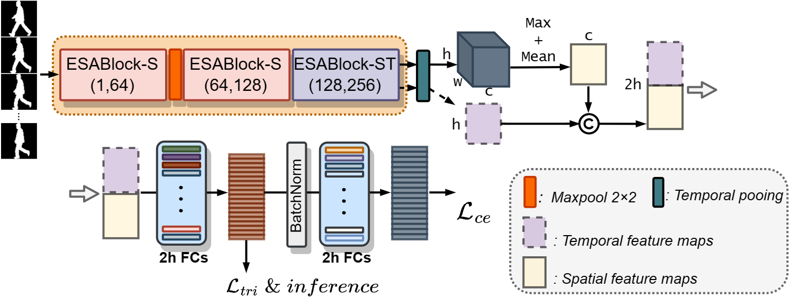
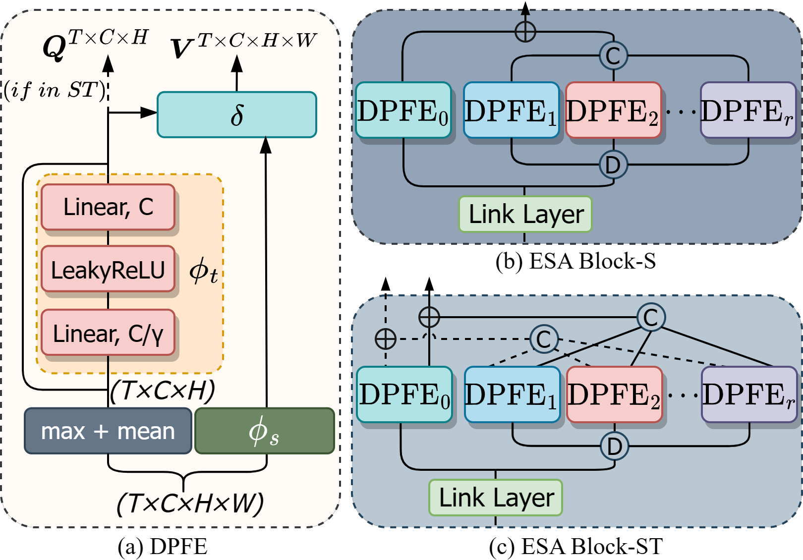
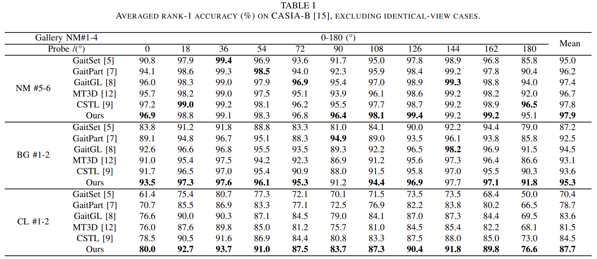
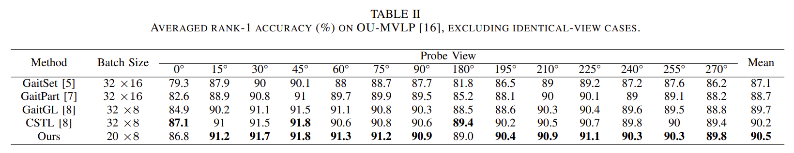

# Efficient Gait Recognition via Spatial-Temporal Decoupled Network

## Method
### Pipeline

### Spatial-temporal Feature Extraction

### Results



## Usage
```python
python run.py
```
## Spacial Thanks
This repo is based on [OpenGait](https://github.com/ShiqiYu/OpenGait).


